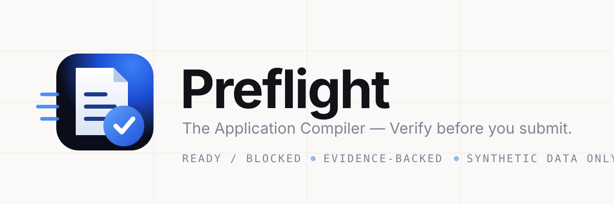

# Preflight — The Application Compiler

> Verify before you submit.



Preflight is a BFWAI/HACK 26 PS-01 MVP: a reliability layer for high-stakes digital applications. It validates a synthetic scholarship application, maps validated applicant data onto a local portal, executes the browser workflow, and independently verifies the resulting state before saving.

[](docs/EVALUATION.md)
[](docs/CONTRACTS.md)
[](docs/CONTRACTS.md)

## Quick start

Development:

```bash
npm install
npm run check
npm run test
npm run eval
npm run build
npm run test:e2e
```

Playwright Chromium may need to be installed once on a fresh clone:

```bash
npx playwright install chromium
```

Production browser-agent runtime (Node + real Chromium):

```bash
npm install
npx playwright install chromium
npm run build
npm run build:server
npm start
```

The production server serves the built console and portal plus `POST
/api/execute`. Static-only hosting cannot run the browser agent — the UI
shows its unavailable state there instead of pretending. No API keys are
required for Demo Mode.

## Judge / Demo Mode

1. Open the deployed URL.
2. Select CASE-002 and run Preflight.
3. Observe BLOCKED + NAME_MISMATCH evidence.
4. Select CASE-001 and run Preflight.
5. Observe READY.
6. Open the synthetic scholarship application.
7. Run the browser agent.
8. Observe real execution, not a simulation:
   - portal inspection
   - semantic field mapping
   - 6 values entered
   - 6 values independently read back
   - draft saved
   - portal state verified as SAVED
9. Review the verified application.
10. Explicitly approve the exact verified state.
11. Observe submission and final-state verification.

Completion is not correctness: every step above is verified against
observed state, never assumed from a completed action. No upload or
personal data is required.

Demo Mode uses bundled synthetic fixtures and the same Preflight validation
pipeline used by the project evaluation. It performs no live LLM inference.

## Final demo sequence

```text
CASE-002 → BLOCKED / name mismatch
  ↓
CASE-001 → READY
  ↓
Open Application → Browser Agent
  ↓
Inspect → Map → Fill → Read Back → Save → Verify → SAVED
  ↓
Human Review → Approval → SUBMITTED → VERIFIED
```

See [docs/DEMO.md](docs/DEMO.md) for the fixed 3-minute sequence.

## Evaluation console

The masthead has an **Evaluation** control that opens a read-only view of the
measured results: standard correctness, the naive baseline, unsafe
continuations prevented, safety probes denied, unauthorized submissions, the
full-set result including the CASE-011 boundary, the OCR run, and per-case
rows. Every number is derived from `eval/results.json` (`npm run eval`) and
`eval/ocr-results.json` (`npm run eval:ocr`) through the harness's own
`computeMetrics`; the UI restates nothing. If an artifact is missing the
console says so instead of showing numbers.

## Project rules

- Synthetic/generated data only.
- AI is used for ambiguity; deterministic code owns correctness and authorization.
- Validation must pass before browser execution.
- BLOCKED applications cannot execute.
- AMBIGUOUS or UNMAPPED required fields cannot execute.
- Browser actions are verified by reading the resulting DOM state.
- Unknown execution states must be verified rather than blindly retried.
- Human approval and synthetic submission are implemented against the local portal only; real-world submission remains out of scope.

## Current MVP

The current vertical slice covers a synthetic scholarship renewal workflow:

1. Synthetic documents are represented through deterministic fixtures.
2. Evidence is assembled into a canonical applicant profile.
3. Deterministic validation detects blocking inconsistencies.
4. A READY profile can inspect the synthetic portal.
5. Portal fields are mapped to canonical fields through the semantic mapping boundary.
6. Playwright fills the mapped fields.
7. Preflight reads the values back from the browser and compares them against expected values.
8. Portal label drift is absorbed by the existing mapper without changing the profile.
9. Save Draft is allowed only after successful verification.
10. The portal's SAVED state is independently verified.
11. A confirmed miss gets exactly one bounded recovery; unknown state escalates instead of retrying.
12. A final review snapshot fingerprints the exact state to be submitted.
13. A human explicitly approves that exact state; any later change voids the approval.
14. Submission is authorized only against a matching approval, then executed in the browser.
15. The SUBMITTED state is independently verified; unknown final state escalates with no blind retry.

Submission exists ONLY against the local synthetic scholarship portal. There is no real government or production submission.

## Core architecture

```text
Synthetic Documents
        ↓
Extraction
        ↓
Canonical Applicant Profile
        ↓
Deterministic Validation
        ↓
   READY / BLOCKED
        ↓
Portal Inspection
        ↓
Semantic Field Mapping
        ↓
Execution Plan
        ↓
Playwright Execution
        ↓
State Verification
   ┌────┼────┐
   ↓    ↓    ↓
EXPECTED  RECOVER  UNKNOWN
   ↓       ↓        ↓
   │    VERIFY    ESCALATE
   └───────┬────────┘
           ↓
         SAVED
           ↓
      FINAL REVIEW
           ↓
   AWAITING APPROVAL
           ↓
    HUMAN APPROVAL
           ↓
   FINGERPRINT CHECK
           ↓
        SUBMIT
           ↓
   FINAL STATE VERIFY
           ↓
       SUBMITTED
           ↓
        VERIFIED
```

Central principle: **AI for ambiguity. Code for correctness.**

Semantic interpretation (what a portal label means) is isolated from deterministic validation, execution authorization, and state verification. A wrong confident interpretation can never silently become a trusted fact.

READY verdict semantics: **READY means Preflight detected no blocking condition under its defined validation and evidence-consistency rules.** It does not mean the information is objectively true, that all extracted values are guaranteed correct, or that the application is guaranteed to be accepted. Consistency and validation are not independent ground truth.

## Browser Agent

Preflight uses Playwright to operate the synthetic scholarship portal after deterministic validation passes.

```text
READY → inspect portal → semantic field mapping → execution plan
  → fill fields → independently read values back → save draft
  → verify SAVED → human approval
```

The browser agent does not treat "no exception thrown" as success. It verifies the resulting DOM state independently.

Production execution is exposed through `POST /api/execute`. The same execution service is shared by the development and production runtime; there is no duplicate browser-execution engine.

## Core documents

- `PRD.md` — product requirements and scope.
- `ARCHITECTURE.md` — system boundaries and state model.
- `docs/CONTRACTS.md` — stable domain interfaces and invariants.
- `TASKS.md` — implementation queue and completed milestones.
- `docs/BUILD_PLAN.md` — implementation order.
- `docs/RUNBOOK.md` — repeatable developer workflow.
- `docs/EVALUATION.md` — evaluation methodology and measured results.
- `docs/DEMO.md` — fixed demo sequence.

## Commands

- `npm run check` — TypeScript type checks.
- `npm test` — Vitest unit, integration, and UI tests.
- `npm run eval` — deterministic fixture evaluation.
- `npm run eval:ocr` — real PaddleOCR over synthetic document images (needs `requirements-ocr.txt`).
- `npm run dev` — start the Preflight UI and synthetic portal locally.
- `npm run build` — production build of the frontend into `dist/`.
- `npm run build:server` — bundle the production Node runtime into `dist-server/` (serves `dist/`, the portal, and `/api/execute`).
- `npm start` — run the production server (`PORT`/`HOST` env, defaults 4173/0.0.0.0).
- `npm run demo:browser` — live browser-agent demo in a terminal (same real execution as the UI bridge; `-- --headed`, `--scenario=flaky-save` supported).
- `npm run test:e2e` — Playwright browser suite (starts Vite automatically).
- `npm run test:e2e:headed` — same suite in a visible browser for debugging.
- `npm run demo:reset` — reset local synthetic demo state.

## Production deployment

Primary: **Vercel Functions (container image)**. Vercel auto-detects the
root-level `Dockerfile.vercel`, builds it into VCR, and routes all traffic
to the resulting function — no `vercel.json` needed for the single service.

The final browser-agent runtime requires:

- Node.js 22 (or newer; the Playwright base image ships its own Node)
- Playwright + Chromium (baked into `mcr.microsoft.com/playwright:v1.63.0-noble`,
  matched to the installed `@playwright/test` 1.63.0)
- a host capable of running a persistent Node process

```bash
npm install
npx playwright install chromium
npm run build
npm run build:server
npm start
```

Endpoints:

- `GET /api/health`
- `GET /api/evaluation` — measured evaluation results, read from the harness artifact
- `POST /api/execute`

Notes and limits:

- The container listens on Vercel's `$PORT` (default 80) and binds `0.0.0.0`
  — no code change was needed; the existing server already reads `PORT`.
- The image is ~2.8 GB uncompressed (Chromium), so the Vercel project must
  use **Large Functions** (public beta, up to 5 GB uncompressed; new projects
  are auto-enrolled, older ones set `VERCEL_SUPPORT_LARGE_FUNCTIONS=1`).
- Browser mode is environment-aware, not display-sniffed: the production
  server runs headless Chromium unconditionally (the console sends no
  `headed` flag at all), so deployed runs behave exactly like a local
  default run. Local `npm run dev` still allows a headed browser through the
  dev-only bridge if you want to watch it.
- No secrets or env vars are required for Demo Mode. Do not add any.
- A `Dockerfile` for Railway-style Docker hosts is also present and uses the
  identical stack and start command (`npm start`).
- Static-only hosts cannot run the browser-agent runtime. No hosting platform
  is claimed beyond what is verified here: the production server path above,
  smoke-tested end to end, including a full Chromium run inside the
  `Dockerfile.vercel` image.

## Project structure

```text
src/
├── domain/
│   ├── validation/
│   ├── profile/
│   ├── mapping/
│   ├── execution/
│   └── submission/
├── adapters/
│   ├── extraction/
│   └── browser/
├── portal/
│   └── scholarship/
└── ui/

tests/
├── unit/
├── integration/
├── ui/
└── e2e/

fixtures/
docs/
```

## Human approval boundary

Submission requires explicit human approval tied to the exact reviewed application state.

The approval contains a deterministic fingerprint of the reviewed state — a state integrity check, not cryptographic security. If a submission-relevant value changes after approval, approval becomes invalid. Therefore approved state ≠ current state means submission refused.

## Safety boundaries

Preflight deliberately separates interpretation from correctness-critical decisions.

AI / semantic layer — used for:

- document interpretation
- ambiguous field meaning
- semantic portal-field mapping

Deterministic layer — owns:

- validation
- required-document checks
- identity consistency
- provenance
- execution preconditions
- mapping acceptance/rejection
- expected-vs-observed verification
- submission authorization

Failure handling is deterministic, not autonomous:

- browser actions are not successful merely because Playwright did not throw
- actual portal state is inspected after every action
- known recoverable failures use a bounded recovery policy (exactly one retry)
- unknown state is preserved as uncertainty and escalated, never blindly retried
- required AMBIGUOUS/UNMAPPED mappings cannot execute
- no submission without explicit approval
- approval is bound to the exact reviewed state
- changed state invalidates approval
- submission authorization is deterministic
- final submission state is independently verified
- unknown submission state is escalated rather than blindly retried

The current implementation uses the deterministic baseline mapping and does not require a paid AI API.

Document ingestion runs real local PaddleOCR (paddleocr 3.7.0, CPU-only,
`requirements-ocr.txt`) over synthetic document images in
`fixtures/documents/`; OCR output (text, confidence, bounding boxes) flows into the
existing extraction contract with full provenance — OCR never decides
validity. A deterministic semantic provider exercises the interpretation
boundary (`EXTRACTION_PROVIDER=semantic`) with zero credentials; model output
is untrusted data and deterministic validation remains the only READY/BLOCKED
authority. Three live-capable semantic providers implement the same
contract, all opt-in and untrusted by design: OpenRouter
(`SEMANTIC_PROVIDER=openrouter`), Google Gemini REST
(`SEMANTIC_PROVIDER=gemini`), and Groq direct API
(`SEMANTIC_PROVIDER=groq`); model identifiers stay configurable and keys
stay local. Real multimodal inference was observed (Gemini and Groq
returned validated candidates on the synthetic identity document), but
free-provider rate limiting and availability prevented a reliable
full-document benchmark — so no live accuracy percentage is claimed.
Deterministic validation remains the only READY/BLOCKED authority.
Measure ingestion separately
with `npm run eval:ocr` (current: 4/4 documents SUCCESS, all expected key
texts detected, minimum confidence 0.989).

## Evaluation

Evaluation uses deterministic synthetic cases. Current fixture evaluation: **8/8 PASS**.

Decision quality is measured over 29 synthetic cases against a documented
naive baseline (`docs/BASELINE.md`, full report in
`docs/EVALUATION_REPORT.md`, machine-readable output in `eval/results.json`):

- Preflight: **28/29 correct** (5 success, 19 block, 3 escalation, 1 recovery)
- False positives: **0** · false negatives (unsafe continuations): **1**
- Unsafe continuations prevented: **23/24**
- Safety probes denied (blocked/unknown/missing/stale/changed/unverified submit attempts): **6/6**
- Uniform-false-evidence detection: **0/1** (measured boundary, see below)
- Reruns produce byte-identical results.

These are results on the current synthetic evaluation set, NOT a general
accuracy claim. On the standard 28-case set the result is 28/28 correct; the
29th case (CASE-011) is a documented boundary: uniformly incorrect but
internally consistent evidence is NOT detected (CASE-011 concludes READY) —
Preflight verifies consistency and workflow correctness across available
evidence, not ground truth. The authorization boundary still holds: explicit
approval remains mandatory even for that READY.

## Testing

Current verified state:

- `npm run check` — PASS
- `npm test` — 226/226 PASS
- `npm run build` — PASS
- `npm run build:server` — PASS
- `npm run test:e2e` — 10/10 PASS
- `npm run eval` — 28/29 (the 1 miss is the documented CASE-011 uniform-consistency boundary)
- `npm run eval:ocr` — 4/4 PASS

The browser suite currently covers:

- portal smoke test
- clean six-field execution
- portal label drift
- recoverable save failure (one bounded recovery)
- unknown save state (escalation, no retry)
- full approval → submission → verification
- approval invalidation on state change
- unknown submission (single attempt, escalation)
- independent read-back
- SAVED state
- zero Submit interaction

## Failure handling

Preflight records structured execution events so a failed run can explain:

- what action was attempted
- what failed
- what state was observed
- whether recovery was safe
- whether recovery occurred
- why escalation happened

Unknown state results in escalation rather than blind retry. The same
state-verification principle applies to final submission: the Submit action
is not proof of a successful submission. The final browser state must be
observed, and an unknown final state means STOP / ESCALATE.

## AI disclosure

Development:

- OpenCode / Muse was used for AI-assisted implementation.

Runtime:

- Demo Mode uses bundled deterministic synthetic fixtures and does not require live LLM inference.
- PaddleOCR performs local document OCR.
- The semantic extraction boundary supports optional OpenRouter, Google Gemini, and Groq providers.
- Runtime model identifiers are configurable.
- Deterministic validation remains the authority for READY/BLOCKED, authorization, and submission safety.
- Live multimodal inference was tested (Gemini and Groq returned validated candidates on the synthetic identity document), but provider availability/rate limiting prevented a reliable full-document benchmark — no live accuracy percentage is claimed.

## Current status

The final MVP includes:

- synthetic document ingestion
- PaddleOCR boundary
- canonical applicant profile
- deterministic validation
- evidence/provenance handling
- semantic portal-field mapping
- real Playwright browser execution
- independent read-back verification
- label-drift recovery
- bounded recovery
- unknown-state escalation
- structured execution trace
- SAVED state verification
- final review snapshot
- human approval gate
- state fingerprint
- approval invalidation
- submission authorization
- synthetic submission
- final-state verification
- production Node runtime
- production `/api/execute` browser-agent bridge
- evaluation harness

Final MVP — demo and submission ready.

## Demo

See [docs/DEMO.md](docs/DEMO.md) for the fixed demo sequence. The demo uses synthetic data and deliberately planted failures.
