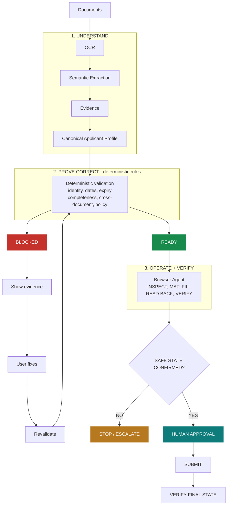

# Preflight — The Application Compiler

> Don't just submit forms. Compile them.


Preflight is an evidence-first reliability layer for high-stakes digital applications. It extracts information from supporting documents, validates the resulting application deterministically, operates a synthetic application portal through a browser agent, independently verifies the resulting state, and requires human approval before irreversible submission.

[](package.json)
[](package.json)
[](package.json)
[](requirements-ocr.txt)
[](playwright.config.ts)
[](package.json)
[](docs/EVALUATION.md)
[](docs/CONTRACTS.md)
[-informational)](docs/CONTRACTS.md)

## Demo

- **Live app:** _TODO — add the deployed Vercel URL once the production deployment is verified._
- **Repository:** https://github.com/DivyanshuRaj7/preflight
- **Demo video:** _TODO — add the hosted video link._

## The Problem

> A form can be completed successfully and still be wrong.

Traditional form automation optimizes for **completion**. The pipeline runs, the fields are filled, no exception is thrown, and the submission is accepted by a system that never asked whether the data behind it was consistent. A stale certificate slips through. A name that differs by one character across two documents is transmitted as fact. A missing income certificate is never noticed because nothing was written to the field that would have revealed it.

Preflight optimizes for **correctness before irreversible action**. Before a single value reaches a portal, the supporting documents are extracted into evidence, assembled into a canonical applicant profile, and checked by deterministic rules that either pass the application or block it with a specific, evidenced reason. Only what survives that gate is allowed to be operated on a portal — and even then, a human approves the exact reviewed state before anything is submitted.

## Core Principle

> **AI FOR AMBIGUITY**
> **CODE FOR CORRECTNESS**
> **HUMAN FOR IRREVERSIBLE ACTIONS**

| Responsibility | Owner |
|---|---|
| Ambiguous document and portal interpretation | AI / semantic layer |
| Correctness-critical decisions | Deterministic code |
| Irreversible submission | Explicit human approval |

Model output is treated as **untrusted evidence**, never as authority. A confident interpretation cannot silently become a trusted fact, because every downstream decision re-derives its own truth from evidence rather than from a model's assertion.

## How Preflight Works



### Architecture

```text
┌─────────────────────────────────────────────────┐
│                                                 │
│  PRE-FLIGHT                                     │
│  THE APPLICATION COMPILER                       │
│                                                 │
└─────────────────────────────────────────────────┘
                       │
┌──────────────────────┼──────────────────────────┐
│  1. UNDERSTAND       │                          │
│                      ▼                          │
│  ┌───────────────────────────────────────────┐  │
│  │ Documents → OCR → Semantic Extraction     │  │
│  │ → Evidence                               │  │
│  └───────────────────────────────────────────┘  │
│                      │                          │
│                      ▼                          │
│  ┌───────────────────────────────────────────┐  │
│  │ Canonical Applicant Profile               │  │
│  └───────────────────────────────────────────┘  │
└──────────────────────┼──────────────────────────┘
                       │
┌──────────────────────┼──────────────────────────┐
│  2. PROVE CORRECT    │                          │
│                      ▼                          │
│  ┌───────────────────────────────────────────┐  │
│  │ deterministic rules                       │  │
│  │ • identity                                │  │
│  │ • dates / expiry                          │  │
│  │ • completeness                            │  │
│  │ • cross-document                          │  │
│  │ • policy rules                            │  │
│  └───────────────────────────────────────────┘  │
│                      │                          │
│          ┌───────────┴───────────┐              │
│          ▼                       ▼              │
│    ● BLOCKED                 ● READY            │
│          │                       │              │
│          ▼                       │              │
│   show evidence                  │              │
│   user fixes                     │              │
│          │                       │              │
│          └──► REVALIDATE         │              │
└──────────────────────────────────┼──────────────┘
                                   │
┌──────────────────────────────────┼──────────────┐
│  3. OPERATE + VERIFY             │              │
│                                  ▼              │
│  ┌───────────────────────────────────────────┐  │
│  │ Browser Agent                             │  │
│  │ INSPECT → MAP → FILL                      │  │
│  │ → READ BACK → VERIFY                      │  │
│  └───────────────────────────────────────────┘  │
│                                  │              │
│                                  ▼              │
│              ┌───────────────────────────┐      │
│              │ SAFE STATE CONFIRMED?     │      │
│              └───────────────────────────┘      │
│                 NO ─────────┬───── YES         │
│                  │           │      │          │
│                  ▼           │      ▼          │
│           STOP /            │  HUMAN APPROVAL │
│           ESCALATE          │      │          │
│                  │           │      ▼          │
│                  │           │   SUBMIT        │
│                  │           │      │          │
│                  │           │      ▼          │
│                  │           │ VERIFY FINAL   │
│                  │           │     STATE       │
└──────────────────┴───────────┴──────────────────┘
```

## Tech Stack

| Layer | Technology | Role |
|---|---|---|
| Frontend | React 18 + Vite + TypeScript | Evidence console, demo mode, application UI |
| Backend | Node.js 22 (`node:http`) + TypeScript | Static serving, `/api/execute`, `/api/evaluation` |
| OCR | PaddleOCR 3.7 (CPU) | Real local document OCR with bounding boxes |
| Semantic extraction | Configurable model providers (OpenRouter / Gemini / Groq) + deterministic baseline | Ambiguous field and document interpretation |
| Browser automation | Playwright 1.63 + Chromium | Portal inspection, filling, read-back, verification |
| Validation | Deterministic TypeScript rules | Identity, dates, expiry, completeness, cross-document checks |
| Evaluation | Custom deterministic harness | Reproducible decision and safety measurements |
| Testing | Vitest + Playwright E2E | Unit/integration/UI and real-browser testing |
| Deployment | Docker (`Dockerfile.vercel`, `Dockerfile`) | Container runtime with Chromium |

There is no Express, database, or external service in the production path — the runtime is a single Node process plus Chromium, which is why it fits in one container.

## Where AI Is Used

### AI / Document Understanding

- OCR and document text extraction through PaddleOCR
- Semantic interpretation of ambiguous document fields
- Document understanding
- Semantic portal-field interpretation where a provider is configured

### Deterministic Validation

- Identity matching
- Date validation
- Expiry checks
- Required-document completeness
- Cross-document consistency
- Policy rules
- Approval state
- Submission permissions
- Evaluation metrics

> AI handles ambiguity. Deterministic code handles correctness.

A deterministic provider implements the same contract as every live provider, so the full pipeline runs with zero credentials and no network access. Demo Mode and the entire evaluation set use that path.

## Browser Agent

```text
INSPECT → MAP → FILL → READ BACK → VERIFY → SAVE → VERIFY FINAL STATE
```

The agent does not assume the portal is static. It opens the real page, inspects the actual DOM, maps each field's meaning to a canonical applicant value, enters the verified values, **reads them back from the portal**, and compares what it observes against what it intended before it is allowed to save. Only after Save Draft does it confirm the portal reports `SAVED`.

The production runtime executes Chromium headlessly and returns a structured trace plus a capture of the portal state the agent left behind. The console renders that trace and per-field expected-vs-observed comparison directly.

## Human Approval Boundary

**READY is not SUBMITTED.** The application being valid is a precondition for submission, never a permission to submit.

```text
READY
  → EXECUTING
  → VERIFYING
  → AWAITING_APPROVAL
  → APPROVED
  → SUBMITTING
  → SUBMITTED
  → VERIFIED
```

An approval is bound to a deterministic fingerprint of the exact reviewed state. If any submission-relevant value changes afterwards, the approval is invalidated and submission is refused. There is no path from `SAVED` to `SUBMITTING` that skips explicit human approval, and the UI is never treated as a boundary — the authorization check lives in deterministic code.

If the browser reaches an unknown or unsafe state at any point: **STOP / ESCALATE**.

## Failure Handling

Only the scenarios below are implemented and tested.

| Scenario | Behaviour | Test |
|---|---|---|
| Portal label change | Semantic mapping re-resolves the field from its label; the canonical profile is untouched | `tests/e2e/label-drift.spec.ts` |
| Save confirmed missed | Actual portal state is read; a confirmed miss gets **one** bounded recovery, then verification again | `tests/e2e/save-recovery.spec.ts` |
| Save outcome unknown | State is inconclusive, so the run **stops and escalates** with no retry | `tests/e2e/save-recovery.spec.ts` |
| Submission outcome unknown | Exactly one attempt, then escalation — never a blind retry | `tests/e2e/unknown-submission.spec.ts` |
| Approval bound to a stale state | Changed snapshot invalidates the approval; submission is refused | `tests/e2e/approval-invalidation.spec.ts` |

The loop is always: detect an unexpected portal state → recover or re-map **only when safe** → verify again → stop and escalate when no safe state can be established. Failure handling is deterministic, not autonomous guesswork.

## Evaluation

Every number below is produced by the repository's evaluation harness and read from committed measurement artifacts — [`eval/results.json`](eval/results.json) (from `npm run eval`) and [`eval/ocr-results.json`](eval/ocr-results.json) (from `npm run eval:ocr`). The Evaluation view in the console renders these same artifacts; it restates nothing.

| Measure | Result |
|---|---:|
| Standard evaluation | 28 / 28 correct |
| Baseline | 8 / 28 correct |
| Unsafe continuations prevented | 23 / 23 |
| Safety probes denied | 6 / 6 |
| Unauthorized submissions | 0 |
| Full evaluation | 28 / 29 |
| OCR evaluation | 4 / 4 |

The baseline is a deliberately naive decision function measured on the identical case set (`docs/BASELINE.md`, full report in [`docs/EVALUATION_REPORT.md`](docs/EVALUATION_REPORT.md)). It exists to measure the gap, not to pass: on the standard set it allows 21 of the 23 unsafe continuations that Preflight prevents.

These are results on this synthetic evaluation set — **not** a general accuracy claim about arbitrary applications.

### CASE-011 — Known Boundary

CASE-011 contains uniformly false but internally consistent evidence. Without an independent source, that evidence cannot prove itself wrong — every field agrees with every other field, and the only signal that something is off is a trusted source Preflight does not have. Preflight therefore returns `READY` where the ground truth is `BLOCK`, and the full evaluation is **28 / 29 rather than 29 / 29**.

This is a real limitation, not a rounding error. It is reported in the artifacts, marked in the console, and listed in the per-case table. The mitigation is structural rather than clever: explicit human approval remains mandatory even for that `READY`, so the boundary cannot become an unauthorized submission.

## Evaluation Cases

| Case | Expected | Finding | Purpose |
|---|---|---|---|
| CASE-001-clean | READY | — | Baseline happy path; all five document types present and consistent |
| CASE-002-name-mismatch | BLOCKED | `NAME_MISMATCH` | Applicant name differs across identity, marksheet, bank proof, and application |
| CASE-003-dob-mismatch | BLOCKED | `DOB_MISMATCH` | Date of birth conflicts between two documents |
| CASE-004-missing-income-certificate | BLOCKED | `MISSING_REQUIRED_DOCUMENT` | Required income certificate absent from the document set |
| CASE-005-expired-certificate | BLOCKED | `DOCUMENT_EXPIRED` | Certificate expiry precedes the evaluation reference date |
| CASE-006-low-confidence-extraction | BLOCKED | `LOW_CONFIDENCE_CRITICAL_FIELD` | Critical field extracted below the confidence threshold |
| CASE-011-consistent-false-evidence | BLOCKED | — | Adversarial consistency boundary: uniformly false but internally coherent evidence |

The full matrix also covers mapping (`ADV-*`), portal-state (`ADV-008`–`ADV-010`), approval (`APPROVAL-OK` / `-STALE` / `-MISSING`), and six submission safety probes.

## Scope

- **Synthetic data only** — no real applicant, document, or credential
- **Synthetic scholarship renewal application** — the demonstrated domain
- **Local synthetic portal** — a fictional target application, not a real government or university portal
- **English-only** demo surface
- **No real financial transactions** and no real submission anywhere

The narrow scope is intentional. The repository demonstrates one reusable reliability pattern — evidence-first verification with a human approval boundary — rather than pretending to solve every application type.

## Quick Start

### Prerequisites

- **Node.js 22** (`package.json` declares `@types/node` ^22; the Playwright base image ships Node 24)
- npm (bundled with Node)
- Python 3 + [`requirements-ocr.txt`](requirements-ocr.txt) — **only** for `npm run eval:ocr`

### Install

```bash
npm ci
```

### Verify

```bash
npm run check     # tsc --noEmit
npm test          # Vitest: 244 tests
```

### Build

```bash
npm run build         # frontend -> dist/
npm run build:server  # production server -> dist-server/
```

### Run

```bash
npm start
```

Serves the console, the synthetic portal, `/api/health`, `/api/evaluation`, and `/api/execute` on **http://127.0.0.1:4173** (override with `PORT`, e.g. `PORT=8080 npm start`).

For frontend development with hot reload:

```bash
npm run dev
```

### Browser / Playwright

A clean machine needs Chromium once — it is required for the E2E suite **and** for the browser agent:

```bash
npx playwright install chromium
```

### Evaluation

```bash
npm run eval       # decision matrix -> eval/results.json
npm run eval:ocr   # real PaddleOCR -> eval/ocr-results.json (needs Python + requirements-ocr.txt)
```

### E2E

```bash
npm run test:e2e           # 12 tests, real Chromium
npm run test:e2e:headed    # same suite in a visible browser
```

## Demo Mode

The console runs entirely on bundled synthetic fixtures. No upload, no credentials, no personal data, no network access.

1. Select a synthetic case in the masthead selector. The demo picker exposes CASE-001 through CASE-006; CASE-007 onward sit in a secondary group.
2. Choose **CASE-002 · Name mismatch** → **Run Preflight** → `BLOCKED` with the `NAME_MISMATCH` finding and both conflicting names shown as evidence.
3. Choose **CASE-001 · Clean application** → **Run Preflight** → `READY`, with coverage counts and the explicit approval requirement.
4. On `READY`, click **Run browser agent** to execute the real Playwright run against the synthetic portal, then **Open Application** to reach `/portal/scholarship-renewal`.
5. Click **Review verified application** to open the review dialog, and **Approve submission** to exercise the human approval gate.
6. Click **Evaluation** in the masthead for the measured results.

Optional: `npm run demo:reset` resets local synthetic demo state, and `npm run demo:browser` runs the same real browser-agent flow in a terminal (`-- --headed` to watch it).

## Repository Structure

```text
src/
├── domain/          # pure logic: validation, profile, mapping, execution, submission, safety
├── adapters/        # I/O boundaries: ocr, extraction, models, browser
├── portal/          # synthetic scholarship portal (the agent's target)
├── server/          # production runtime, execution service, evaluation service
└── ui/              # React console

scripts/             # evaluation harness, OCR harness, demo helpers
eval/                # committed measurement artifacts
fixtures/            # synthetic cases, expected outcomes, documents, adversarial sets
tests/               # unit, integration, eval, ui, e2e
docs/                # PRD, architecture, contracts, evaluation, demo, runbook
```

Key documents: [`PRD.md`](PRD.md) · [`ARCHITECTURE.md`](ARCHITECTURE.md) · [`DESIGN.md`](DESIGN.md) · [`docs/CONTRACTS.md`](docs/CONTRACTS.md) · [`docs/EVALUATION.md`](docs/EVALUATION.md) · [`docs/EVALUATION_REPORT.md`](docs/EVALUATION_REPORT.md) · [`docs/BASELINE.md`](docs/BASELINE.md) · [`docs/FAILURE_COVERAGE.md`](docs/FAILURE_COVERAGE.md) · [`docs/DEMO.md`](docs/DEMO.md) · [`docs/RUNBOOK.md`](docs/RUNBOOK.md)

## Deployment

- **Container runtime:** `Dockerfile.vercel` (Vercel auto-detects it at the repository root) and `Dockerfile` for any Docker host. Both use `mcr.microsoft.com/playwright:v1.63.0-noble`, so Chromium and its Linux dependencies ship with the image — no second browser install.
- **Start command:** `npm start`. The server binds `0.0.0.0` and reads `$PORT`, which Vercel provides.
- **Production browser execution is headless.** There is no X server on a deployed host; the server enforces headless Chromium unconditionally and ignores any client request for a visible window.
- **Image size:** roughly 2.8 GB uncompressed, which requires Vercel **Large Functions** (projects created before 2026-06-30 need `VERCEL_SUPPORT_LARGE_FUNCTIONS=1`).
- **Stateless:** no persistent runtime state, no database. Evaluation artifacts are committed snapshots read at request time; the browser agent drives a fresh page per run.
- **Static-only hosts cannot run the browser agent.** The console degrades to an explicit unavailable state there instead of pretending.

## Testing

| Suite | Command | Result |
|---|---|---|
| Unit / integration / UI | `npm test` | **244 / 244** |
| End-to-end (real Chromium) | `npm run test:e2e` | **12 / 12** |
| Decision evaluation | `npm run eval` | **28 / 29** |
| OCR evaluation | `npm run eval:ocr` | **4 / 4** |
| Type check | `npm run check` | clean |
| Production build | `npm run build` + `npm run build:server` | pass |

The single decision-evaluation miss is the documented CASE-011 consistency boundary described above.

## Judge Quick Path

For a reviewer with a few minutes:

1. Open the deployed app.
2. Run **CASE-002** → `BLOCKED`, applicant name mismatch, both values shown as evidence.
3. Run **CASE-001** → `READY`, no blocking issues.
4. Click **Open Application** → the synthetic scholarship portal.
5. Click **Run browser agent** → real inspection, mapping, filling, and read-back.
6. Inspect the independently verified values and the confirmed `SAVED` state.
7. Open **Evaluation** → `28 / 28`, `8 / 28`, `23 / 23`, `6 / 6`, `0`, `28 / 29`, `4 / 4`.
8. Inspect **CASE-011** in the per-case table and read why it is a boundary rather than a pass.
9. Follow **Quick Start** above if reproducibility needs to be checked.

## AI Tool Disclosure

### Runtime AI / ML

- **PaddleOCR 3.7** — real local OCR over the synthetic document images, CPU-only, no API key
- **Configurable semantic model providers** — OpenRouter, Google Gemini, and Groq implement the same untrusted-evidence contract. Demo Mode, the E2E suite, and the entire evaluation set run on the deterministic provider and require **no** API keys. Live multimodal inference was exercised during development (Gemini and Groq returned validated candidates on the synthetic identity document), but provider availability and rate limiting prevented a reliable full-document benchmark, so **no live model accuracy figure is claimed**.

### Development Tools

- **OpenCode** with the **Muse Spark 1.3** model was used for AI-assisted implementation during the challenge.

No development model was part of the production runtime, and no paid API was required to build, test, or evaluate this project.

## Known Limitations

- **CASE-011 consistency boundary.** Uniformly false but internally coherent evidence cannot be detected without an independent source; the full evaluation is 28 / 29, not 29 / 29.
- **Synthetic portal only.** The browser agent targets a fictional scholarship portal. No real government or university portal is contacted.
- **Synthetic data only.** No real applicant data, documents, or credentials exist anywhere in the repository.
- **English-only** demo surface.
- **Evaluation artifacts are committed snapshots.** The console reports the numbers from the last harness run committed to the repository, not a live re-measurement.
- **OCR metrics depend on the committed OCR artifact** and on Python + PaddleOCR being available to regenerate it.
- **Single-region, single-process runtime.** Execution is serialized per process; concurrent `/api/execute` calls on one instance are refused with HTTP 409.

## Project Rules

- Synthetic/generated data only.
- AI is used for ambiguity; deterministic code owns correctness and authorization.
- Validation must pass before browser execution.
- BLOCKED applications cannot execute.
- AMBIGUOUS or UNMAPPED required fields cannot execute.
- Browser actions are verified by reading the resulting DOM state.
- Unknown execution states must be verified rather than blindly retried.
- Human approval and submission are implemented against the synthetic portal only; real-world submission remains out of scope.

## Current Status

Final MVP — demo and submission ready. It includes synthetic document ingestion, a PaddleOCR boundary, a canonical applicant profile, deterministic validation, evidence and provenance handling, semantic portal-field mapping, real Playwright browser execution, independent read-back verification, label-drift recovery, bounded recovery, unknown-state escalation, a structured execution trace, `SAVED` verification, a final review snapshot, a human approval gate, a state fingerprint, approval invalidation, submission authorization, synthetic submission, final-state verification, a production Node runtime, a production `/api/execute` browser-agent bridge, an evidence-backed evaluation console, and the evaluation harness.